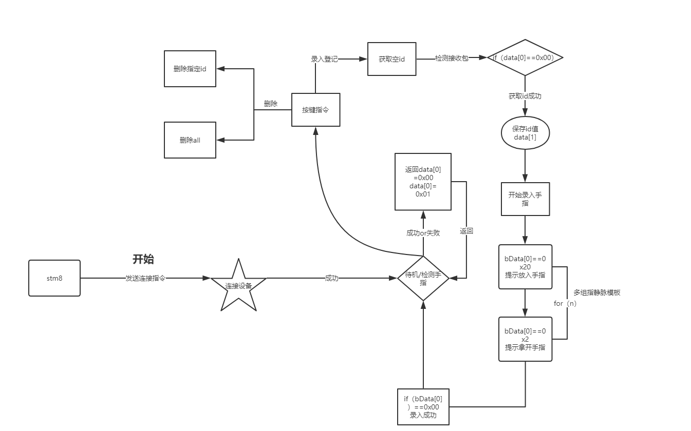

# stm8052r8

## ·指静脉开发

设备模块：指静脉识别—乙木V9

### 1，流程图



### 2，功能管脚INIT

##### 1，usart初始化

功能：实现数据接收发送。

```
	 CLK_PeripheralClockConfig（CLK_Peripheral_USART1，ENABLE）; //启用或禁止外围设备
	 时钟GPIO_ExternalPullUpConfig（GPIOC，GPIO_Pin_2 | GPIO_Pin_3，ENABLE）; //配置GPIOX引脚的上拉
	 USART_Init（USART1，// 
           		    （uint32_t的）115200，//波特率 
            		    USART_WordLength_8b，//数据长度 
          		    USART_StopBits_1，//停止位 
         		    USART_Parity_No，//校验位 
         		    USART_Mode_Tx | USART_Mode_Rx）; //接收发送使能

	enableInterrupts（）; //
	  打开总中断/ *启用USART接收中断：当USART 
   		 接收数据寄存器不为空
	时，将生成此中断* / USART_ITConfig（USART1，USART_IT_RXNE，ENABLE）;
  		/ *启用USART发送完成中断：当USART 
   		 发送移位寄存器为空
  		时，将生成此中断* / // USART_ITConfig（USART1，USART_IT_TC，ENABLE）; 
	USART_Cmd（USART1，ENABLE）; //使能usart
}
INTERRUPT_HANDLER（USART1_RX_TIM5_CC_IRQHandler，28）
{
  / *为了在开发过程中检测到意外事件，
     建议在以下指令上设置断点。
* / // #ifdef USE_STM8L1526_EVAL uint8_t temp;  

  

  / *从接收数据寄存器中读取一个字节并将其发送回* / 
  temp =（ USART_ReceiveData8（USART1）＆ 0x7F）; // 
   USART_SendData8（USART1，temp）;
// #endif / * USE_STM8L1526_EVAL * / 
}
```

##### 2，tim4初始化

功能：实现1ms定时

```
void  tim4config（void）{
   // GPIO_Init（GPIOG，GPIO_Pin_4，GPIO_Mode_Out_PP_Low_Fast）; 
  CLK_PeripheralClockConfig（CLK_Peripheral_TIM4，ENABLE）;
  TIM4_TimeBaseInit（TIM4_Prescaler_64，250）; // 1ms 
  TIM4_SetCounter（250）; //计数器初值250，产生更新事件
  TIM4_ITConfig（TIM4_IT_Update，ENABLE）;
  enableInterrupts（）;
  TIM4_Cmd（ENABLE）;
}
```

stm8系统时钟为16MHZ，将系统时钟一分频

```
   CLK_SYSCLKDivConfig(CLK_SYSCLKDiv_1); 
```

因为测试串口接收是用8分频，接收数据不完整，还有错误。（**待验证**）

##### 3，按钮初始化

功能：实现外部中断控制增删操作。

查看文档，其开发板按键定管脚。只有PE6＆PE7可以使用EXTI。PC端口无。

目标实现按键控制。

```
＃定义 LED_GPIO_PORT   GPIOG
 ＃定义 LED_GPIO_PINS   GPIO_Pin_4 | GPIO_Pin_5 | GPIO_Pin_6 | GPIO_Pin_7 //
 初始化
   GPIOG管脚GPIO_Init（LED_GPIO_PORT，LED_GPIO_PINS，GPIO_Mode_Out_PP_High_Fast）;
//创建按键初始化--PE6＆PE7 
void  key1_init（void）
{
    输入上拉，外部中断
    GPIO_Init（GPIOE，GPIO_Pin_6，GPIO_Mode_In_PU_IT）； //设置GPIOE，GPIO_Pin_6作为中断源。
    //设置所选引脚的外部中断灵敏度。
    // EXTI_Trigger_Falling：仅在下降沿中断
    EXTI_SetPinSensitivity（EXTI_Pin_6，EXTI_Trigger_Falling）;
    GPIO_Init（GPIOE，GPIO_Pin_7，GPIO_Mode_In_PU_IT）;
    EXTI_SetPinSensitivity（EXTI_Pin_7，EXTI_Trigger_Falling）;
    
    // GPIOB GPIO_Pin_0管脚为指静脉信号输入。
    / *
       GPIO_Mode_In_FL_IT =（uint8_t）0×20，    
      悬空，置低
      <！输入浮动，外部中断
      GPIO_Mode_In_PU_IT =（uint8_t）0X60，   
      上拉。置高
   	  <！输入上拉，外部中断
* / GPIO_Init（GPIOB，GPIO_Pin_0，GPIO_Mode_In_FL_IT）; //指静脉输出高允许EXTI_SetPinSensitivity（EXTI_Pin_0，EXTI_Trigger_Falling）;
    enableInterrupts（）; //启用    
    
    
}
//进入中断处理函数EXTI6＆7 
/ * * 
  * @brief外部IT PIN6中断例程。
  * @param无
  * @retval无
* / INTERRUPT_HANDLER（EXTI6_IRQHandler， 14）  

{
  / *为了在开发过程中检测到意外事件，
     建议在以下指令上设置断点。
* / EXTI_ClearITPendingBit（EXTI_IT_Pin6）;
    //读取pin管脚的输入状态if（ GPIO_ReadInputDataBit（GPIOE，GPIO_Pin_6）== RESET）    
   
   
  {
        GPIO_ResetBits（GPIOG，GPIO_Pin_5）;        
        延迟（20000）;
        GPIO_SetBits（GPIOG，GPIO_Pin_5）;
  }   
   //后期更改标志
 
}

/ * * 
  * @brief外部IT PIN7中断例程。
  * @参数无
  * @retval无
* / INTERRUPT_HANDLER（EXTI7_IRQHandler， 15）  

{
  / *为了在开发过程中检测到意外事件，
     建议在以下指令上设置断点。
* / EXTI_ClearITPendingBit（EXTI_IT_Pin7）;
   如果（ GPIO_ReadInputDataBit（ GPIOE，GPIO_Pin_7）== RESET）  
    
  {
        GPIO_ResetBits（GPIOG，GPIO_Pin_4）;
        
        延迟（20000）;
        GPIO_SetBits（GPIOG，GPIO_Pin_4）;
        
  }   
     //后期更改标志
 
}
//进入主初始化初始化函数。
// GPIO管脚功能
typedef  枚举
{
  GPIO_Mode_In_FL_No_IT =（uint8_t）为0x00，    / * <！输入浮动，没有外部中断* / 
  GPIO_Mode_In_PU_No_IT =（uint8_t）0x40的，    / * <！输入上拉，没有外部中断* / 
  GPIO_Mode_In_FL_IT =（uint8_t）为0x20，    / *！ <输入浮动，外部中断* / 
  GPIO_Mode_In_PU_IT =（uint8_t）0x60，    / *！<输入上拉，外部中断* / 
  GPIO_Mode_Out_OD_Low_Fast =（uint8_t）0XA0，    / * <！输出漏极开路，低电平，为10MHz * / 
  GPIO_Mode_Out_PP_Low_Fast =（uint8_t）取值为0xE0，    / * <！输出推挽，低电平，10MHz的* / 
  GPIO_Mode_Out_OD_Low_Slow =（uint8_t）0x80的，    / *！ <输出开漏低电平2MHz * / 
  GPIO_Mode_Out_PP_Low_Slow =（uint8_t）0xC0，    / *！<输出推挽低电平2MHz * / 
  GPIO_Mode_Out_OD_HiZ_Fast =（uint8_t）0xB0，    / *！<输出漏极开路，高阻抗电平，10MHz * / 
  GPIO_Mode_Out_PP_High_Fast =（uint8_t）0xF0，    / *！<输出输出推挽，高电平，10MHz * / 
  GPIO_Mode_Out_OD_Hi_Slow =（uint8_t）0x90，    / *！<输出-漏极高阻抗电平，2MHz * / 
  GPIO_Mode_Out_PP_High_Slow =（uint8_t）0xD0     / *！<输出推挽，高电平，2MHz * / 
} GPIO_Mode_TypeDef;
```

### 3，stm8052r8发送/接收指令

| 发送指令列表                                                 |                                                              | 接收指令                                                     |                                 |
| ------------------------------------------------------------ | ------------------------------------------------------------ | ------------------------------------------------------------ | ------------------------------- |
| BB AA 00 01 00 08 30 30 30 30 30 30 30 30 00 00 00 00 00 00 00 00 00 EE 02 | 连接设备                                                     | BB AA 00 01 00 10 00 58 47 2D 56 38 00 00 00 00 00 00 00 00 00 00 03 D3 02 | 连接成功                        |
| BB AA 00 02 00 00 00 00 00 00 00 00 00 00 00 00 00 00 00 00 00 00 00 00 67 01 | 关闭设备                                                     | BB AA 00 02 00 01 00 00 00 00 00 00 00 00 00 00 00 00 00 00 00 00 00 68 01 | 关闭成功                        |
| BB AA 00 03 00 00 00 00 00 00 00 00 00 00 00 00 00 00 00 00 00 00 00 68 01 | 获取版本信息                                                 | BB AA 00 03 00 10 00 02 04 00 04 01 05 00 00 00 00 05 05 00 00 00 00 8D 01 | 主/子版本号，设备编号，波特率， |
|                                                              |                                                              |                                                              | 安全等级，检测超时，            |
|                                                              |                                                              |                                                              | 重复检查，相同手检查            |
| BB AA 00 04 00 00 00 00 00 00 00 00 00 00 00 00 00 00 00 00 00 00 00 00 01 01 | 恢复出厂设置                                                 | （未测试）                                                   |                                 |
| BB AA 00 14 00 00 00 00 00 00 00 00 00 00 00 00 00 00 00 00 00 00 00 00 79 01 | 获取系统用户数据                                             | BB AA 00 14 00 0F 00 02 00 00 00 09 00 00 00 64 00 00 00 06 01 0A 08 02 |                                 |
| BB AA 00 13 00 00 00 00 00 00 00 00 00 00 00 00 00 00 00 00 00 00 00 78 01 | 获取空id                                                     | BB AA 00 13 00 05 00 01 00 00 00 00 00 00 00 00 00 00 00 00 00 00 00 00 7E 01 | 返回值                          |
|                                                              |                                                              |                                                              |                                 |
| BB AA 00 10 00 00 00 00 00 00 00 00 00 00 00 00 00 00 00 00 00 00 00 75 01 | 检测手指                                                     | BB AA 00 10 00 02 00 01 01 01 00 00 00 00 00 00 00 00 00 00 00 00 00 00 7A 01 | 检测成功返回数据[7] = 01        |
|                                                              |                                                              | BB AA 00 10 00 02 00 00 00 00 00 00 00 00 00 00 00 00 00 00 00 00 00 00 77 01 | 未检测到返回data [7] = 00       |
| BB AA 00 16 00 06 01 00 00 00 00 03 00 00 00 00 00 00 00 00 00 00 00 85 01 | 多次登记                                                     |                                                              |                                 |
|                                                              | BB AA 00 16 00 02 00 01 02 00 00 03 00 00 00 00 00 00 00 00 00 00 00 83 01 | 录入成功                                                     |                                 |
| BB AA 00 17 00 04 01 00 00 00 00 00 00 00 00 00 00 00 00 00 00 00 00 9D 01 | 1：n验证                                                     |                                                              |                                 |
| BB AA 00 26 00 00 00 00 00 00 00 00 00 00 00 00 00 00 00 00 00 00 00 8B 01 | 获取调试信息                                                 |                                                              |                                 |
| BB AA 00 15 00 04 01 00 00 00 00 00 00 00 00 00 00 00 00 00 00 00 00 7F 01 | 获取id信息                                                   | BB AA 00 15 00 02 00 06 00 00 00 00 00 00 00 00 00 00 00 00 00 00 00 00 82 01 | 6个模板                         |
| BB AA 00 17 00 05 01 00 00 00 00 00 00 00 00 00 00 00 00 00 00 00 00 00 82 01 | 1：1验证                                                     |                                                              |                                 |
| BB AA 00 11 00 04 01 00 00 00 00 00 00 00 00 00 00 00 00 00 00 00 00 7B 01 | 删除用户                                                     |                                                              |                                 |
|                                                              |                                                              |                                                              |                                 |
| BB AA 00 18 00 00 00 00 00 00 00 00 00 00 00 00 00 00 00 00 00 00 00 7D 01 | 免费识别模式                                                 | （发送一条指令，只能检测一次）                               |                                 |
|                                                              |                                                              | BB AA 00 18 00 01 20 00 00 00 00 00 00 00 00 00 00 00 00 00 00 00 00 00 9E 01 | 放入手指                        |
|                                                              |                                                              | BB AA 00 18 00 01 21 00 00 00 00 00 00 00 00 00 00 00 00 00 00 00 00 00 9F 01 | 取出手指                        |
|                                                              |                                                              | BB AA 00 18 00 06 00 01 00 00 00 00 00 00 00 00 00 00 00 00 00 00 00 00 84 01 | 验证成功                        |
| BB AA 00 19 00 00 00 00 00 00 00 00 00 00 00 00 00 00 00 00 00 00 00 7E 01 | 取消FREE识别模式                                             | BB AA 00 19 00 01 00 00 00 00 00 00 00 00 00 00 00 00 00 00 00 00 00 7F 01 | 取消成功                        |
| BB AA 00 05 00 01 00 00 00 00 00 00 00 00 00 00 00 00 00 00 00 00 00 6B 01 | 设置设备编号（0）                                            | 设备属性设置                                                 |                                 |
| BB AA 00 07 00 01 01 00 00 00 00 00 00 00 00 00 00 00 00 00 00 00 00 6E 01 | 设置安全等级（较高）                                         |                                                              |                                 |
| BB AA 00 08 00 01 05 00 00 00 00 00 00 00 00 00 00 00 00 00 00 00 00 00 73 01 | 等待超时（5s）                                               |                                                              |                                 |
|                                                              | 重复登记检查（默认）否                                       |                                                              |                                 |
|                                                              | 相同手指检查（默认）否                                       |                                                              |                                 |
|                                                              | 设置新密码（NULL）                                           |                                                              |                                 |
|                                                              | 验证密码（NULL）                                             |                                                              |                                 |
|                                                              |                                                              |                                                              |                                 |
| BB AA 00 0C 00 00 00 00 00 00 00 00 00 00 00 00 00 00 00 00 00 00 00 00 71 01 | 重启重启设备                                                 |                                                              |                                 |
|                                                              |                                                              |                                                              |                                 |

### 具体实现

1，连接设备

如果返回的数据数据[0] = 0x00;则表示连接成功。（称为是你录入过指静脉才可以进入2，否则进入用户登记）

2，进入FREE手指检测模式

如果返回数据数据[0] = 0x00，则进入检测模式。当手指插入模块，首先会给stm8一个接通信号，

??然后是提示放入手指，拿开手指，并且进入手指1：n检测模式，如果匹配则返回数据包data [0] == 0x00。

失败则返回到待机模式。

| BB AA 00 18 00 01 20 00 00 00 00 00 00 00 00 00 00 00 00 00 00 00 00 00 9E 01 | 放入手指 |
| ------------------------------------------------------------ | -------- |
| BB AA 00 18 00 01 21 00 00 00 00 00 00 00 00 00 00 00 00 00 00 00 00 00 9F 01 | 取出手指 |
| BB AA 00 18 00 06 00 01 00 00 00 00 00 00 00 00 00 00 00 00 00 00 00 00 84 01 | 验证成功 |

3，手指检测模式。

检测有手指data [0] = 0x00，data [1] = 0x01

检测无手指data [0] = 0x00，data [1] = 0x00

4，获取空id

首先发送获取空id指令，并返回的数据包中iddata [n] n = 0,1,2,3

ID = bData [1] +（bData [2] << 8）+（bData [3] << 16）+（bData [4] << 24）;

成功数据[0] = 0x00，失败数据[0] = 0x01;（无id可用）

5，用户登记

指定ID注册，一次注册可以采集模板，也可以采集多个模板（最多3个模板）。

此指令正常登记会返回多个返回包，只有接收到XG_ERR_SUCCESS或XG_ERR_FAIL返回值时才结束登记过程。

|                                                              |              |
| ------------------------------------------------------------ | ------------ |
| BB AA 00 16 00 03 **20** 00 00 00 00 03 00 00 00 00 00 00 00 00 00 00 00 A1 01 | 提示加入手指 |
| BB AA 00 16 00 03 **21** 00 00 00 00 03 00 00 00 00 00 00 00 00 00 00 00 A2 01 | 提示拿开手指 |
| BB AA 00 16 00 03 20 01 01 00 00 03 00 00 00 00 00 00 00 00 00 00 00 A3 01 | 提示加入手指 |
| BB AA 00 16 00 03 21 01 01 00 00 03 00 00 00 00 00 00 00 00 00 00 00 A4 01 | 提示拿开手指 |
| BB AA 00 16 00 03 20 02 02 00 00 03 00 00 00 00 00 00 00 00 00 00 00 A5 01 | 提示加入手指 |
| BB AA 00 16 00 03 21 02 02 00 00 03 00 00 00 00 00 00 00 00 00 00 00 A6 01 | 提示拿开手指 |
| BB AA 00 16 00 02 00 01 02 00 00 03 00 00 00 00 00 00 00 00 00 00 00 83 01 | 录入成功     |

实际录入过程需要多次，大概录入（5-6）次

录入成功返回到FREE待机检测状态。

6，删除用户

指定id用户删除。id由外部指定

删除全部用户-----------

| 指定id。01                                                   |          |
| ------------------------------------------------------------ | -------- |
| BB AA 00 11 00 04 01 00 00 00 00 00 00 00 00 00 00 00 00 00 00 00 00 7B 01 | 删除用户 |

7，恢复出厂设置

测试：按键发送恢复出厂设置命令

|                                                              |              |
| ------------------------------------------------------------ | ------------ |
| BB AA 00 04 00 00 00 00 00 00 00 00 00 00 00 00 00 00 00 00 00 00 00 00 01 01 | 恢复出厂设置 |

成功返回data [0] = 0x00;

失败返回data [0] = 0x01;

附录：用户使用手册见《 XG-V2019 +用户手册》